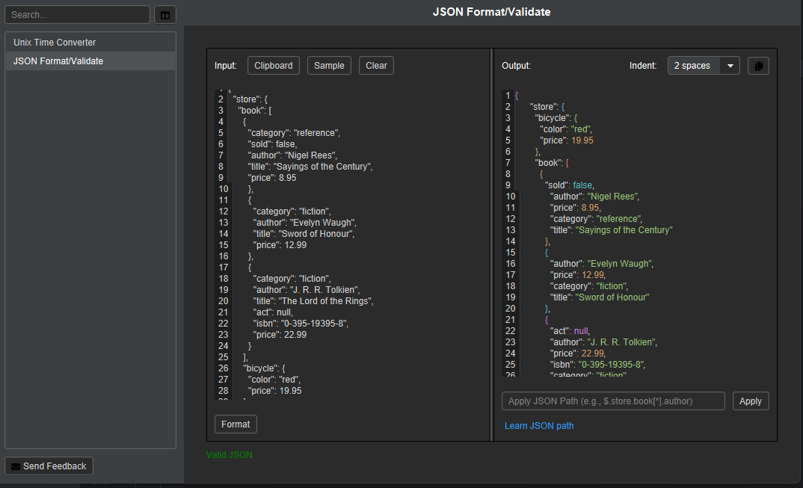

# ZsDevUtil

ZsDevUtil is a JavaFx application that try to copy functionality of  [DevUtils](https://devutils.com/demo/).

## Current Feature

### Unix Time Converter
 Converting unix time into human-readable format and vice-versa
 

### JSON Format/Validate
Validate and format JSON input

## Building
### Production
 - Set environment variables `APP_ENV=prod` Or provide jvm arguments `-Dapp.env=prod` ,then run the build script

